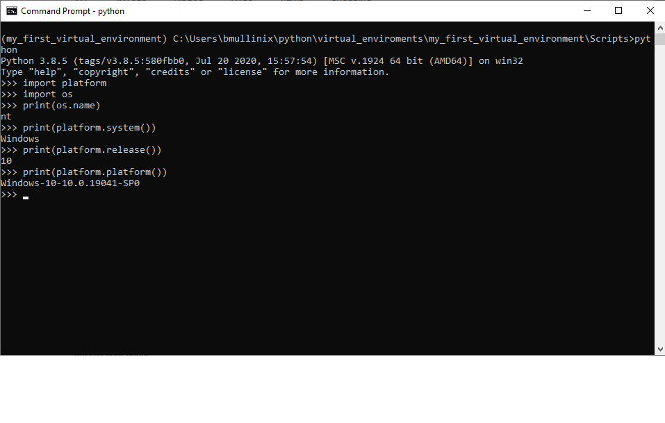
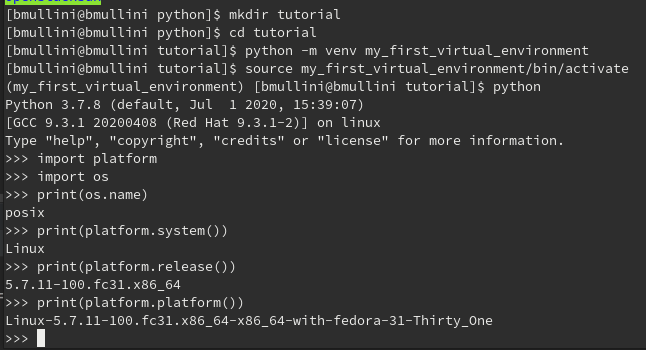

# Working with Python

Last updated: 08.27.2020

## Purpose

The purpose of this document is to show how to install and work with python.

## Prerequisites

### Install Python 3 on Windows

1. Download the latest Python Windows Installer [here](https://www.python.org/downloads/release/python-385/).
1. Run the installer and make sure you check box "Add Python 3.8 to PATH"
1.  In the "Type to Search box", enter "cmd".
    This opens up an MSDOS terminal window.
1. Run `python --version` and you should see the version of Python you are running.

### Install Python 3 on Fedora or Centos

1. sudo dnf install python3
1. Run `python --version`
1. Your python version should be at least version 3.

## Procedures

### Setting up your virtual environment

1. Open up a terminal.
1. Create a Python virtual environment by typing the following:

    1. python -m venv my_first_virtual_environment
    
        1. On Windows, run the following:
        
              - Run `cd .\my_first_virtual_environment\Scripts`
              - Run `.\activate.bat`
              - Run `pip list`
              - You should only get a couple of installs, but not the **docker** library.
              - Run `pip install docker`
              - Run pip list
              - You should get **docker** and other new dependencies listed
              - Run `.\deactivate.bat`
              - cd \
              - Run `pip list`
              - You should not have **docker** installed.  The reason the **docker** library isn't installed is
                because when you run **activate.bat** in your virtual environment, the library installs 
                in your virtual_environment, not the system environment.  When you run **deactivate.bat**,
                python installs libraries in your system environment.  By having a virtual environment for different
                purposes, you avoid conflicts.  For example, one application requires one version of a library and
                another application requires another version of the same library in the same environment.
                Only one version of a library can be installed in an environment at once.

        1. On Fedora and Centos, run the following:        
              
              - Run `cd ./my_first_virtual_environment/bin
              - Run `source ./activate`
              - Run `pip list`
              - You should only get a couple of installs, but not the **docker** library.
              - Run `pip install docker`
              - Run pip list
              - You should get **docker** and other new dependencies listed
              - Run `deactivate`
              - cd /
              - Run `pip list`
              - You should not have **docker** installed.  The reason the **docker** library isn't installed is
                because when you run **source ./\[virtual env\]/bin/activate** in your virtual environment, 
                the library installs in your virtual_environment, not the system environment.  When you run **deactivate**,
                python installs libraries in your system environment.  By having a virtual environment for different
                purposes, you avoid the conflicts.  For example, one application requires one version of a library and
                another application requires another version of the same library in the same environment.
                Only one version of a library can be installed in an environment at once.
    
1. Activate your virtual environment as was shown above.

### Running Adhoc Commands

1. Run `python` 
1. Run the following commands to import libraries to display operating system information:

    1. import platform
    1. import os  

1. Run the following commands to display the operating system information.

    1. print(os.name)
    1. print(platform.system())
    1. print(platform.release())  
    1. print(platform.platform())

    The following image represents the Windows output:
    
    
    
    The following image represents the Fedora output:
    
    
 
1. To close the python terminal run `exit()`

### Setting up an Integrated Development Environment (IDE)

While running commands from the python terminal is nice, if you want
to program in Python with the most productivity, you should set up
an IDE.  There are many IDEs out there.  The one I've used and will
use in this tutorial is the IntelliJ community edition.

#### Setting up the IDE on Windows

1. Download the windows installer [here](https://www.jetbrains.com/idea/download/#section=linux).
1. Download the **Community** edition
1. Open up a command prompt
1. cd c:\
1. mkdir python
1. cd python
1. mkdir applications
1. cd applications
1. mkdir first_application
1. mkdir second_application
1. mkdir virtual_environments
1. In the Downloads folder, click the **idealc...** installer.
1. As you navigate through the installer, make sure you select the
   checkbox **64 bit launcher** under the title **Create Desktop Shortcut**.
1. Finally, click the **Install** button.
1. In the **Type here to search** text box, type **IntelliJ**.
1. Select the **IntelliJ Community Edition...** app.
1. A privacy policy should come up.  Read the policy and check
   **I have read and accept the terms of the agreement**.
1. Select the **Continue** button.
1. On the next screen, you can choose to send statistics or not.
1. On the next screen, select the button **Skip Remaining and Set Defaults**.
1. Click on the button **Open or Import**.
1. Select c:\python\applications\first_application
1. In the screen that appears you should see the **Project** explorer window 
   on the left part of the screen.  The **Project** explorer window shows
   a tree with the **first_application** folder.
1. Within the **Project** explorer window, highlight the **first_application**
   folder
1. Select the **File** menu, and then the menu item **Settings**
1. Select the **Plugins** option on the left screen.
1. In the **Type/to see options** box, type **python**
1. Select the **Python Community Edition** plugin and wait for it to
   install.
1. Click the **OK** button.
1. Select the **File** menu, and then the menu item **Project Structure**.
1. Under **Platform Settings**, select **SDKs**
1. On the right panel, select the **+** button.
1. Click on the button "Add Python SDK..."
1. Make sure **Virtual Environment** is clicked and highlighted
1. Make sure the option "New Environment" is selected.
1. Click the **folder** button for the location.
1. Select the c:\python\applications\virtual_environments path.
1. At the end of the path, type "first_application_venv"
1. Select the "OK" button and wait for the virtual environment to be
   created.
1. Select the "Apply" button
1. On the left screen, under **Project Settings** select the **Project** item.
1. Under the right screen and **Project SDKs** select your python virtual
   environment.
1. Select the **Apply** button, and then the **OK** button. 
1. Click on the "Download" button.
1. On the right panel, wait until the Java Open JDK is installed.
1. Click on the **Apply** button
1. Add another SDK by selecting the **+** button.

[**<--Back to main instructions**](../readme.md)