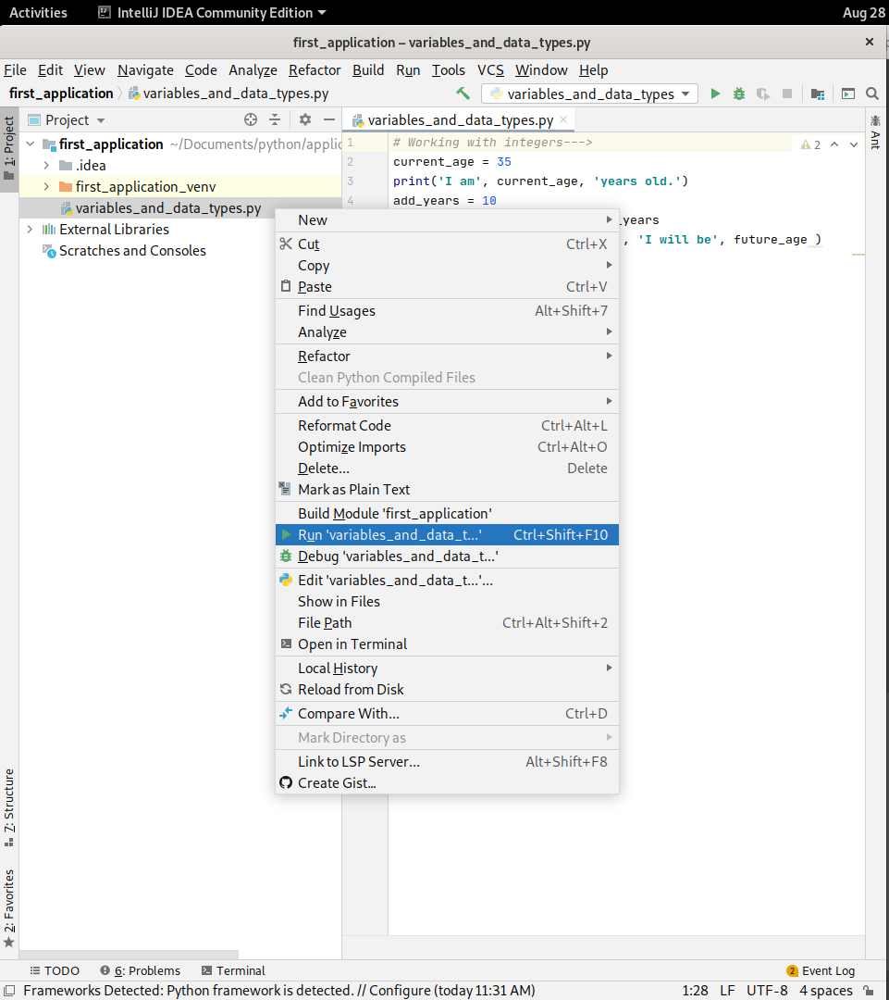
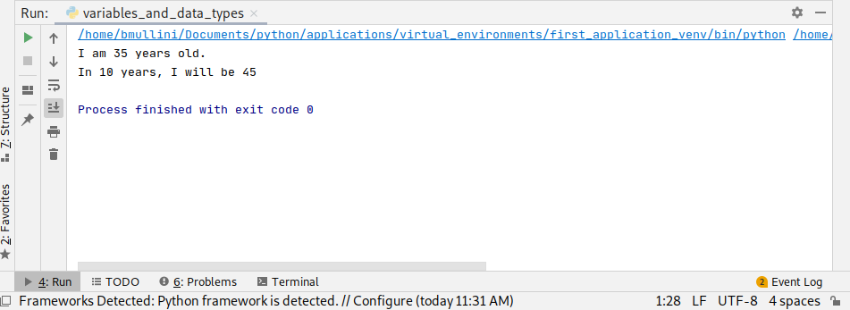
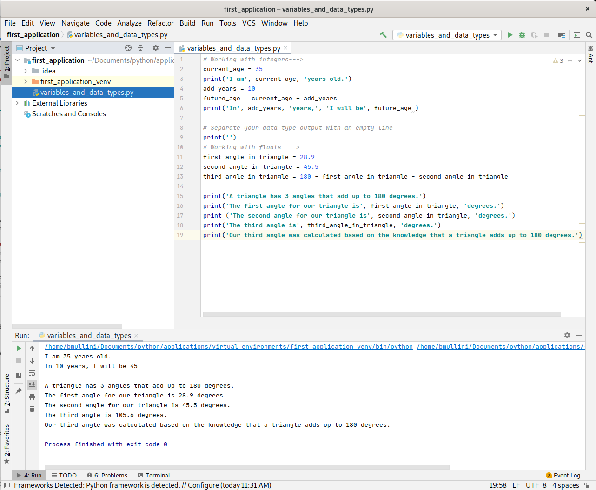
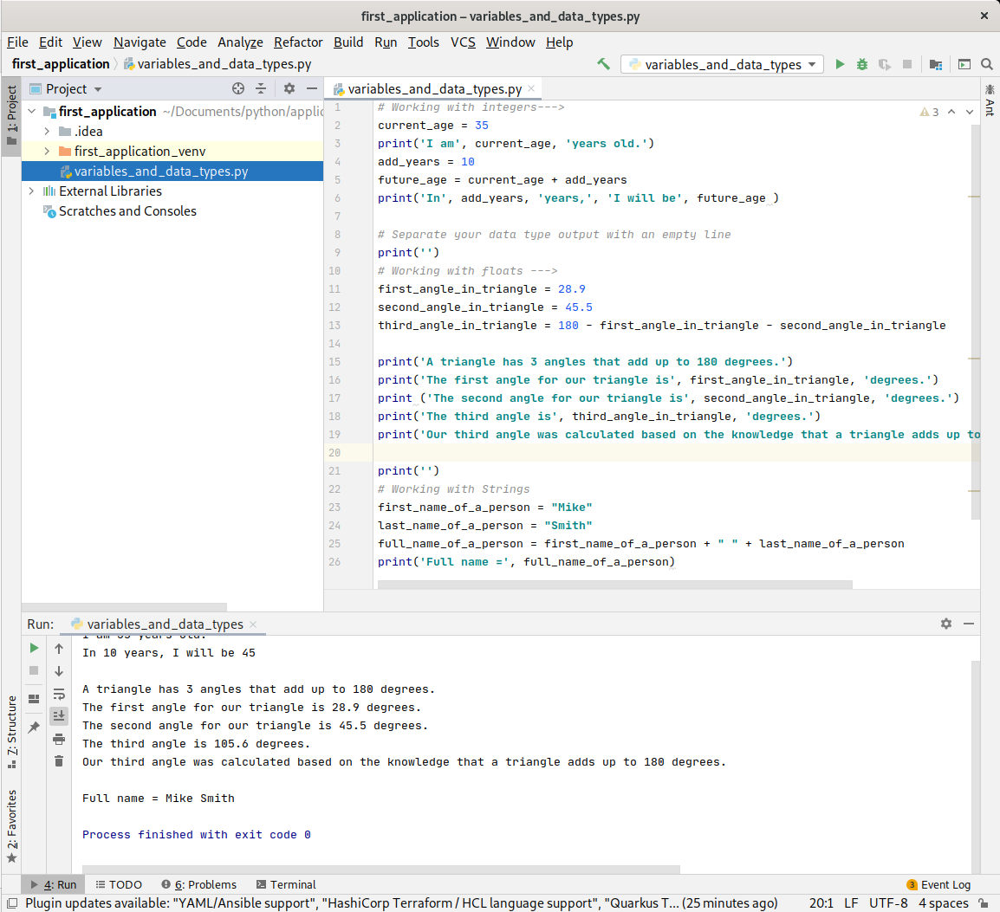

# Working with Python:  Learn about Variables and Data Types

Last updated: 08.28.2020

## Purpose

The purpose of this tutorial is to show how to work with variables and data types.   

- **Variables** are locations in memory that store values with a data type. For instance, a variable assigned the
  value of **35** stores the integer in a location in memory.

- **Data types** are the classification of a value. For instance, the number **35** is an integer data type.

## Prerequisites

You have finished the [t1-getting-started-tutorial](../t1-getting-started/readme.md).  This tutorial sets up
Python and IntelliJ for future tutorials.

## Procedures

1. Open up your IntelliJ application. 

    

    On the left part of the screen, you should see the **Project** window and the **first_application**
    folder should be visible. If the **first_application** folder is not open, go to the **File** menu,
    click on the **Open..** menu item, and navigate to the **first_application** folder.

1. Highlight the folder **first_application** in the **Project** window.
1. Right click on **first_application**, select the menu item **New** and the sub menu **Python File** to
create a new Python file as is shown below.

    

1. Name the new file **variables_and_data_types.py**.  Your screen should appear like the screenshot below.
   On the left **Project** window, your python file name is highlighted.  On the right window, your python file
   contents appear.  This is where you will enter your code for the tutorial.

    

### Working with Integers

1. Type the following in your python file.

    

    Lets break down the code:

    1. The line `# Working with integers --->` is called a comment.  Comments are not executed.
       They just provide clarification on the intent of the code.  In this case, the
       comment is used to show the work we are doing with integers.

    1. The line `current_age = 35` creates a variable called **current_age** and assigns the variable the
       value of the integer **35**.  Once the variable is assigned **35**, the variable becomes an
       **integer** data type.

    1. The line `print('I am', current_age, 'years old.')` says to call the **print** method.  The method
       is used to output the **arguments** passed in as a sentence with each **argument** being separated
       by a space.  The **arguments** are the string **literal** 'I am',
       the variable **current_age**, and the string **literal** 'years old.'.

        1. **method** = A method is a block of code that is called by a name.  In the case above, the
           method is called **print**.

        1. **argument** = An argument is a value given to one of the method **parameters**.  One of the arguments
           above is the **variable current_age**.  The variable has a value of **35** when it is passed into
           the **print** method.

        1. **parameter** = A **method** can have one or more variables passed in.  The variable passed in
           is called a **parameter**.

        1. **literal** = A literal is a fixed value like 'I am' or 35.  The value doesn't change like
           a variable can.
        
    1. The line `add_years = 10` creates a variable called **add_years** and assigns the variable the value
       of **10**.  Once the variable is assigned **10**, the variable becomes an **integer** data type.

    1. The line `future_age = current_age + add_years` adds the integer **current_age**, with a value of 35,
       to the integer **add_years**, with a value of 10.  The resulting addition is assigned to the 
       variable **future_age**.  After the assignment, **future_age** becomes an **integer** data type.

    1. The line `print('In', add_years, 'years.', 'I will be', future_age)` says to call the **print** method.
       The method is used to output the **arguments** passed in as a sentence with each **argument** being
       separated by a space.  The **arguments** are the string **literal** 'In', the variable **add_years**,
       the string **literal** 'years.', the string **literal** 'I will be', and the variable **future_age**.

1. Click the **variabls_and_data_types.py** file name in the **Project** window.
1. Right click **variables_and_data_types.py** file name in the **Project** window.
1. In the context menu that appears, click the run menu item as is shown below.

    

1. You should get the output shown below.

    

## Working with floats

Floats are numbers with fractions.  For instance, the number **17** is not a float, but the number **17.1** is.

1. Add the float code below to your python file, and run the python file like was shown above.

    

    Lets break down the code:

    1. The line `first_angle_in_triangle = 28.9` creates a variable called **first_angle_in_triangle**
       and assigns the variable a value of **28.9**.  Once the variable is assigned the value, the
       variable becomes a **float** data type.  Also, notice the variable is named for what the value is.
       The variable is the first angle in a triangle we are defining.  When writing code, use a descriptive
       variable name so when you or someone else comes back to maintain the code, the variable clearly documents
       its intent. 
    
    1. The line `second_angle_in_triangle = 45.5` creates a variable called **second_angle_in_triangle**
       and assigns the variable a value of **45.5**.  Once the variable is assigned the value, the
       variable becomes a **float** data type.  Also, notice the variable is named for what the value is.
       The variable is the second angle in a triangle we are defining.  When writing code, use a descriptive
       variable name so when you or someone else comes back to maintain the code, the variable clearly documents
       its intent.

    1. The line `third_angle_in_triangle = 180 - first_angle_in_triangle - second_angle_in_triangle` 
       creates a variable called **third_angle_in_triangle** and assigns the variable a calculated
       value based on the knowledge that a triangle is 180 degrees.  Once the variable is assigned the value, the
       variable becomes a **float** data type.  Also, notice the variable is named for what the value is.
       The variable is the third angle in a triangle we are defining.  When writing code, use a descriptive
       variable name so when you or someone else comes back to maintain the code, the variable clearly documents
       its intent.

    1. The rest of the code simply takes the variables, like in the integer example, and prints out messages
       about the triangle.

    1. The output is shown in the lower window in the image above.

## Working with strings

Strings are a finite set of characters from an alphabet.  Examples of strings were given above.

1. Add the string code below to your python file, and run the python file like was shown below.

    

    Lets break down the code:

    1. The line `first_name_of_a_person = "Mike"` creates a variable called **first_name_of_a_person** 
       and assigns the variable a value of **Mike**.  The quotes around the the value are required 
       to delineate the start and end of the string.  The quotes can be single or double quotes.  
       Once the variable is assigned the value, the variable becomes a **string** data type.  Also, notice
       the variable is named for what the value is.  The variable is the first name of a person.  When
       writing code, use a descriptive variable name so when you or someone else comes back to maintain
       the code, the variable clearly documents its intent.

    1. The line `last_name_of_a_person = "Smith"` creates a variable called **last_name_of_a_person** 
       and assigns the variable a value of **Smith**.  The quotes around the the value are required 
       to delineate the start and end of the string.  The quotes can be single or double quotes.  
       Once the variable is assigned the value, the variable becomes a **string** data type.  Also, notice
       the variable is named for what the value is.  The variable is the last name of a person.  When
       writing code, use a descriptive variable name so when you or someone else comes back to maintain
       the code, the variable clearly documents its intent.

    1. The line `full_name_of_a_person = first_name_of_a_person + " " + last_name_of_a_person"` creates 
       a variable called **full_name_of_a_person** and assigns the variable a calculated value.  
       The calculated value is the variable **first_name_of_a_person** added 
       (this is typically called **concatenated** instead of added when talking about strings) 
       to a space and the variable **last_name_of_a_person**. Once the variable is assigned the value, 
       the variable becomes a **string** data type.  Also, notice the variable is named for what the value is.  
       The variable is the full name of a person.  When writing code, use a descriptive variable name so when you or      
       someone else comes back to maintain the code, the variable clearly documents its intent.

    1. The output is shown in the lower window in the image above.

The tutorial on variables and data types has now been completed.  As you learn Python, you will come
across many other Python data types.  I've only shown the **integer**, **float**, and **string** data
types because those are the data types I've used most frequently through 20+ years in programming.

To continue to learn more about Python, please proceed back to the main instructions.

[**<--Back to main instructions**](../readme.md)
