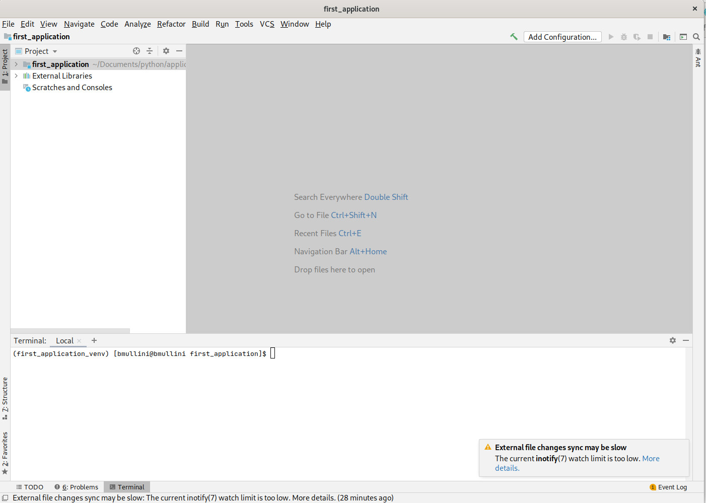
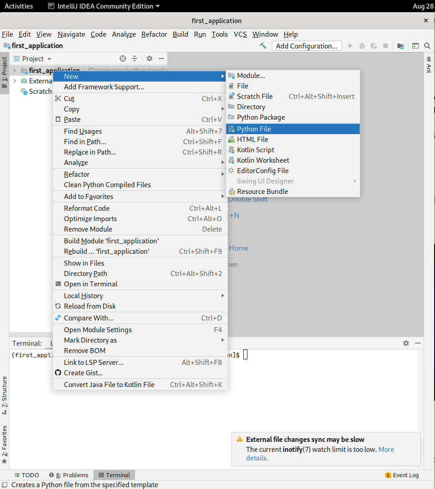
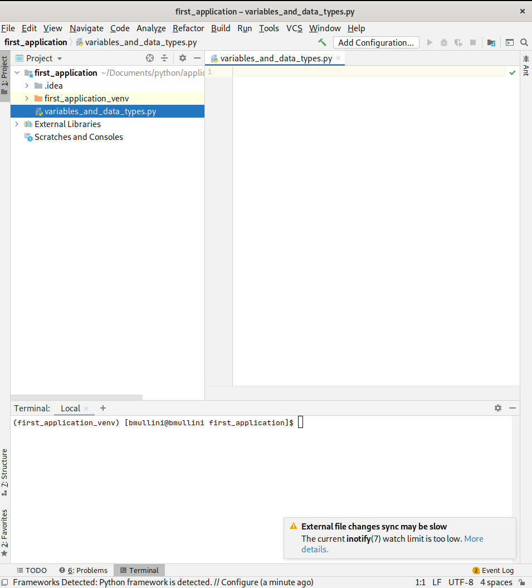
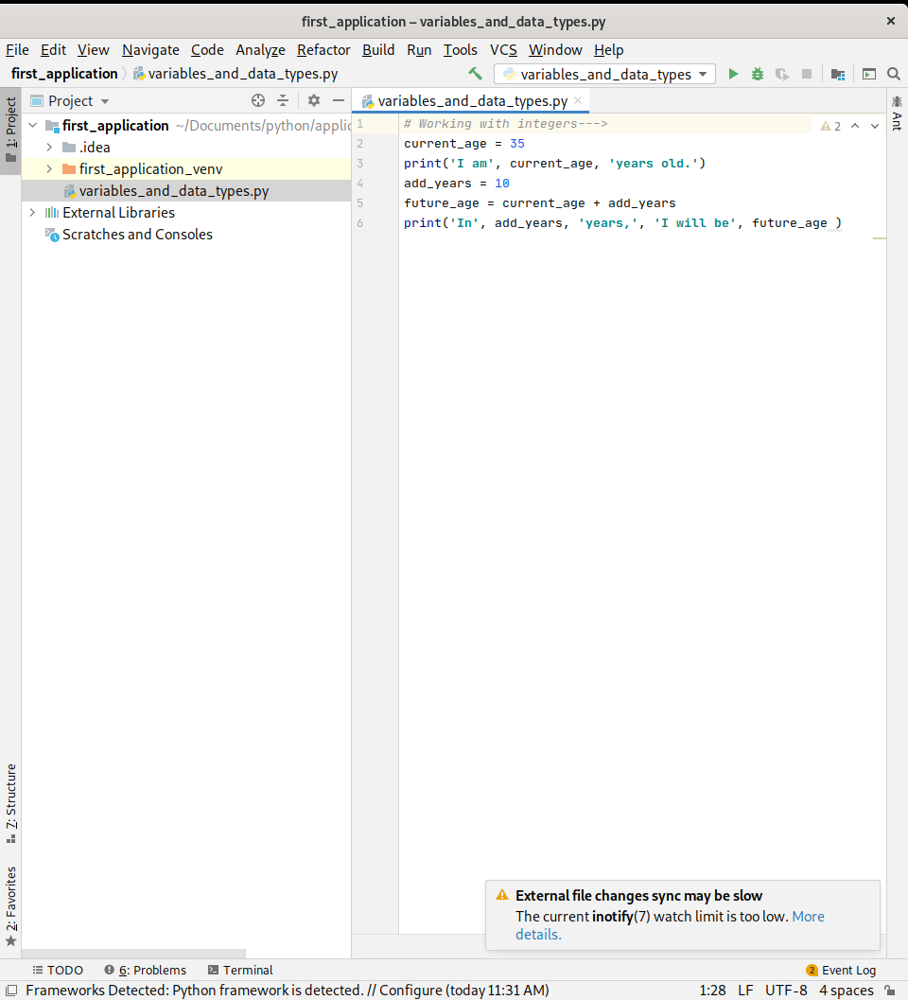

# Working with Python:  Learn about Variables and Data Types

Last updated: 08.28.2020

## Purpose

The purpose of this tutorial is to show how to work with variables and data types.

## Prerequisites

You have finished the [t1-getting-started-tutorial](../t1-getting-started/readme.md).  This tutorial sets up
Python and IntelliJ for future tutorials.

## Procedures

1. Open up your IntelliJ application. 

    

    On the left part of the screen, you should see the **Project** window and the **first_application**
    folder should be visible. If the **first_application** folder is not open, go to the **File** menu,
    click on the **Open..** menu item, and navigate to the **first_application** folder.

1. Highlight the folder **first_application** in the **Project** window.
1. Right click on **first_application**, select the menu item **New** and the sub menu **Python File** to
create a new Python file as is shown below.

    

1. Name the new file **variables_and_data_types.py**.  Your screen should appear like the screenshot below.
   On the left **Project** window, your python file name is highlighted.  On the right window, your python file
   contents appear.  This is where you will enter your code for the tutorial.

    

### Working with Integers

1. Type the following in your python file.

    

    Lets break down the code:

    1. The line `# Working with integers --->` is called a comment.  Comments are not executed.
       They just provide clarification on the intent of the code.  In this case, the
       comment is used to show the work we are doing with integers.

    1. The line `current_age = 35` creates a variable called **current_age** and assigns the variable the
       value of the integer **35**.  Once the variable is assigned **35**, the variable becomes an
       **integer** data type.

    1. The line `print('I am', current_age, 'years old.')` says to call the method **print**.  The method
       is used to output the **arguments** passed in as a sentence with each **argument** being separated
       by a space.  The **arguments** are the string **literal** 'I am',
       the variable **current_age**, and the string **literal** 'years old.'.

        1. **method** = A **method** is a block of code that is called by a name.  In the case above, the
           **method** was called **print**.

        1. **argument** = An argument is a value given to one of the method **parameters**.  One of the arguments
           above is the **variable current_age**.  The variable has a value of **35** when it is passed into
           the **print** method.

        1. **parameter** = A **method** can have one or more variables passed in.  The variable passed in
           is called a **parameter**

        1. **literal** = A literal is a fixed value like 'I am' or 35.  The value doesn't change like
           a variable can.
        
    1. The line `add_years = 10` creates a variable called **add_years** and assigns the variable the value
       of **10**.  Once the variable is assigned **10**, the variable becomes an **integer** data type.

    1. The line `future_age = current_age + add_years` adds the integer **current_age**, with a value of 35,
       to the integer **add_years**, with a value of 10.  The resulting addition is assigned to the 
       variable **future_age**.  After the assignment, **future_age** becomes an **integer** data type.

:construction:

[**<--Back to main instructions**](../readme.md)
