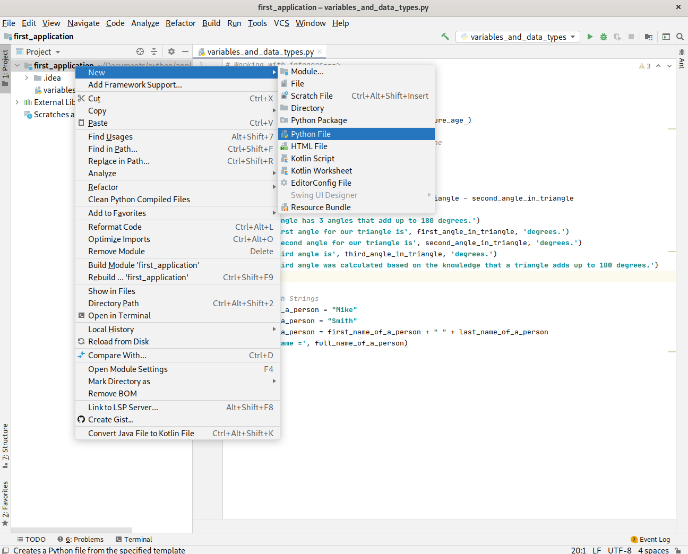

# Working with Python:  Object Oriented Programming (OOP)

Last updated: 08.31.2020

## Purpose

The purpose of this tutorial is to show how to get started working with Object Oriented Programming (OOP).  There
are many reasons why you would use OOP to model your applications.  The example I provide here is to simplify
your code for maintainability.  Later tutorials will provide many other reasons why you would want to adopt
OOP.  

## Prerequisites

You have finished the [t2-variables-and-data-types-tutorial](../t2-variables-and-data-types/readme.md).  This tutorial provides the necessary foundation you need to perform this tutorial.  If you already have a foundation in using variables like **string**, **integer**, and **float**, you may skip this prerequisite.

## Procedures

1. Open up your IntelliJ application. 

    

    On the left part of the screen, you should see the **Project** window and the **first_application**
    folder should be visible. If the **first_application** folder is not open, go to the **File** menu,
    click on the **Open..** menu item, and navigate to the **first_application** folder.

1. Highlight the folder **first_application** in the **Project** window.
1. Right click on **first_application**, select the menu item **New** and the sub menu **Python File** to
create a new Python file as is shown below.

    

1. Name the new file **a-little-object-oriented-programming.py**.  Your screen should appear like the screenshot below.
   On the left **Project** window, your python file name is highlighted.  On the right window, your python file
   contents appear.  This is where you will enter your code for the tutorial.

    


### Using Primitive Data Types to Represent Your Application

We are going to first program a set of addresses using **primitive** data types.  **Primitive** data types are the most basic data types used in a programming language.  Some examples of **primitive** data types are the **integer**,
**float**, and **string**.

1. Type the following in your python file.

    

    Let's break down the code:

    1. The line `print ('Primitive Types to Represent Your Application ---->\n')` says to call the print method.
       The method is used to output the **argument**.  The **argument** is the string **literal** 'Primitive
       Types to Represent Your Application --->\n'.  The '\n' character at the end of the string is a special
       character that tells Python to print a new line.

        1. **method** = A method is a block of code that is called by a name.  In the case above, the
           method is called **print**.

        1. **argument** = An argument is a value given to one of the method **parameters**.

        1. **parameter** = A **method** can have one or more variables passed in.  The variable passed in
           is called a **parameter**.

        1. **literal** = A literal is a fixed value like 'I am' or 35.  The value doesn't change like
           a variable can.

    1. The line `print('Your home address is the following:')` says to call the **print** method.  The
       method is used to output the **argument**.  The **argument** is the string **literal** 'Your
       home address is the following:'.

    1. The line `print('')` just prints an empty string.  This output is identical to the output you
       would get if you added a new line character ('\n') to the end of the previous **print** statement.
        
    1. The line `print('\t' + home_street)` prints a tab character ('\t') followed by the variable
       **home_street**.  Previously, **home_street** was assigned the value of '50 Carter Way'.
       We added the tab character to format the output of the home address in a more appealing way.

    1. The line `print('\t' + home_city)` prints a tab character ('\t') followed by the variable
       **home_city**.  Previously, **home_city** was assigned the value of 'Springfield'.
       We added the tab character to format the output of the home address in a more appealing way.

    1. The line `print('\t' + home_state)` prints a tab character ('\t') followed by the variable
       **home_state**.  Previously, **home_state** was assigned the value of 'VA'.
       We added the tab character to format the output of the home address in a more appealing way.

    1. The line `print('\t' + home_zip)` prints a tab character ('\t') followed by the variable
       **home_zip**.  Previously, **home_zip** was assigned the value of '22102'.
       We added the tab character to format the output of the home zip code in a more appealing way.

    1. The rest of the code is the work address.  The code is similar to the home address.

1. Click the **a-little-object-oriented-programming.py** file name in the **Project** window.
1. Right click **a-little-object-oriented-programming.py** file name in the **Project** window.
1. In the context menu that appears, click the run menu item as is shown below.

    

1. You should get the output shown below.

    

### Using Object Oriented Programming (OOP) to Represent Your Application

The code above uses primitive types to represent addresses for home and work.  We ended up with
a total of 4 variables for each address.  The code above is not easily maintainable.  Each variable
does not represent the intent of the object it represents, and variables could easily be
copied and pasted in future code where a home address variable ended up being used where a work address
variable was intended.  Let's build the same example using OOP.

1. Create the python file **Address.py**.  Type the following code in the file.  The code represents
   a Python class.  A Python class is a data type that can be used to represent real world objects.
   For instance, this class is the **Address** class, and we plan on creating two instances of this class,
   a **home** address and a **work** address.

     

    Let's break down the code:

    1. The line `class Address:` declares the **Address** class.  Any code indented will belong to this class.
    1. The line `def __init__(self, p_street, p_city, p_state, p_zip):` is a special method called a **constructor**
       for a class.  For example, let's say you create an address using this class represented by the following code:
       
        ```
        johns_address = Address('25 English Street', 'Ricksville', 'IL', '55555')
        ```

        When you say 'Address(....)', this calls the **\_\_init\_\_** method.   

        Below is an explanation of the assignment of values to parameters for John's address:

        - The street '25 English Street' represents the value for the **p_street** parameter.
        - The city 'Ricksville' represents the value for the **p_city** parameter.
        - The state 'IL' represents the value for the **p_state** parameter.
        - The zip '55555' represents the value for the **p_zip** parameter.

        The **self** parameter in the **\_\_init\_\_** method is always the first parameter of every method
        belonging to an object (instance) of the address class.  The **self** parameter is used to create
        object (instance) variables and call other object (instance) methods of an address object. Address objects
        are like the object **johns_address** above or an object called **work_address** to represent
        a work address.  The objects are instances of the address class.  Each object has different
        values for variables for the address class and occupy different areas in memory.

        The code line is also known as the **method signature**.  The **method signature** defines what the
        name of the method is and the parameters.  Optionally, the data types of the parameters
        and the result can be added to the **method signature**.

    1. The line `self.street = p_street` assigns the **p_street** parameter to the object (instance) 
       variable **self.street**.  This line is part of the **\_\_init\_\_** method because the line
       is indented by one more tab then the method signature.

    1. The line `self.city = p_city` assigns the **p_city** parameter to the object (instance) variable
       **self.city**. This line is part of the **\_\_init\_\_** method because the line
       is indented by one more tab then the method signature.

    1. The line `self.state = p_state` assigns the **p_state** parameter to the object (instance) variable
       **self.state**. This line is part of the **\_\_init\_\_** method because the line
       is indented by one more tab then the method signature.

    1. The line `self.zip = p_zip` assigns the **p_zip** parameter to the object (instance) variable
       **self.zip**. This line is part of the **\_\_init\_\_** method because the line
       is indented by one more tab then the method signature.
 
    1. The line `def __str__(self):` is a special method that is called when you run the **print** method.
       The **print** method outputs the result of this method which is a **string** data type representation 
       of the object.  If this method is not created (implemented) by the developer, the **Address** object would 
       print out the default implementation of this method.  The default implementation is not
       formatted well and prints details that would confuse a lot of people.  Our implementation prints
       out the object in the same format that the primitive variables used in the last section.

         Also, notice how this line has the same number of indentions as the method constructor.
         This indicates that the method belongs to the class just like the constructor. 
         
         In addition to looking at the methods being lined up to determine ownership,
         you can tell the method belongs to the class because the method is indented one more tab
         compared to the **Address:** line.  The **Address:** line is called the **class declaration**. 
        
1. Add the following code to the end of the **a-little-object-oriented-programming.py** file.

    ```python
       print('--------------------------------------------------------------------------------------------------')
       from address import Address

       print ('OOP to Represent Your Application ---->\n')

       print('Your OOP home address is the following:')
       print('')
       home_address = Address('50 Carter Way', 'Springfield', 'VA', '22150')
       print(home_address)

       print('')
       print('Your OOP work address is the following:')
       print('')
       work_address = Address('125 Independence Lane', 'Tysons Corner', 'VA', '22102')
       print(work_address)
    ```

    Let's break down the code:

    1. The line `from address import Address` says to import the **Address** class from the **address.py** file so
       that the current code can reference the **Address** class.

    1. The line `print ('OOP to Represent Your Application ---->\n')` simply marks the start of OOP code
       to print out the addresses.  The **\n** character is used to print a new line after the text.

    1. The line `print('Your OOP home address is the following:')` simply marks the start of the home address
       object creation code and printing out the object.

    1. The line `print('')` simply adds an empty line to the output.

    1. The line `home_address = Address('50 Carter Way', 'Springfield', 'VA', '22150')` creates the home
       address variable. When creating the home address, remember the constructor of the **Address** is being
       called.

    1. The line `print(home_address)` calls the **print** method.  Then, the **print** method internally calls
       the Address object method **\_\_str\_\_** to get the object into a **string** variable.  Finally, the
       **print** method prints the output to the screen using the **string** variable.

    1. The line `print('')` simply adds an empty line to the output.

    1. The line `print('Your OOP work address is the following:')` simply marks the start of the work address
       object creation code and printing out the object.

    1. The line `print('')` simply adds an empty line to the output.

    1. The line `work_address = Address('125 Independence Lane', 'Tysons Corner', 'VA', '22102')` creates the work
       address variable. When creating the work address, remember the constructor of the **Address** is being
       called.

    1. The line `print(work_address)` calls the **print** method.  Then, the **print** method internally calls
       the Address object method **\_\_str\_\_** to get the object into a **string** variable.  Finally, the
       **print** method prints the output to the screen using the **string** variable.

1. Run the **a-little-object-oriented-programming.py** file.  You should get the following output.


The output prints out the addresses using the primitives and using the Address class.  Notice, how using
Object Oriented Programming (OOP) makes your code more maintainable.  The code contains less variables
to reduce possible errors in future code, the code is smaller indicating the intent of the variables more clearly,
and by using OOP, programmers can think of your code in terms of a real world object, an address.  Programmers
no longer have to look at the primitives and think of individual variables and other code to come up with the
idea of addresses and which variable belongs to which address.


We have finished our first tutorial on OOP.  To continue to learn more about Python, please proceed back to the main instructions.


[**<--Back to main instructions**](../readme.md)
