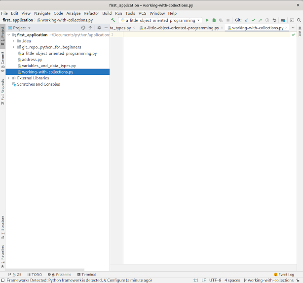

# Working with Python:  Collections

Last updated: 09.03.2020

## Purpose

The purpose of this tutorial is to show how to get started working with collections.  There
are many reasons why you would use collections in your code.  The examples I provide here
are just to get you started with collections.  Later tutorials will provide other examples
of using collections.

## Prerequisites

You have finished the [t2-variables-and-data-types-tutorial](../t2-variables-and-data-types/readme.md).  This tutorial provides one of the necessary foundations you need to perform this tutorial.  If you already have a foundation in using variables like **string**, **integer**, and **float**, you may skip this prerequisite.

You have finished the [t3-object-oriented-programming](../t3-object-oriented-programming/readme.md).  This tutorial provides one of the necessary foundations you need to perform this tutorial.  If you already have a foundation in using the **class** data type, you may skip this prerequisite.

## Procedures

1. Open up your IntelliJ application. 

    

    On the left part of the screen, you should see the **Project** window and the **first_application**
    folder should be visible. If the **first_application** folder is not open, go to the **File** menu,
    click on the **Open..** menu item, and navigate to the **first_application** folder.

1. Highlight the folder **first_application** in the **Project** window.
1. Right click on **first_application**, select the menu item **New** and the sub menu **Python File** to
create a new Python file as is shown below.

    

1. Name the new file **working-with-collections.py**.  Your screen should appear like the screenshot below.
   On the left **Project** window, your python file name is highlighted.  On the right window, your python file
   contents appear.  This is where you will enter your code for the tutorial.

    


1. Enter the following code into your python file.

    ```python
      class_sizes = [22,24,42,15,7,17]
    
      current_index = 0
      length = len(class_sizes)

      # Calculate the average class size
      sum_of_class_sizes = 0
      while current_index < length:
        sum_of_class_sizes += class_sizes[current_index]
        current_index += 1
      
      average_class_size = round(sum_of_class_sizes/length)

      print('Your average class size is', average_class_size)

    ```

    The following code is used to calculate an average class size.  The code puts all the class sizes into a
    **list** data type, loops through the list to compute the sum of all class sizes, computes the average,
    and prints the average.  Note:  The loop code is not maintainable.  A better looping mechanism will be
    used after the concepts of indexes, a list, and looping through the list are explained. 

    Let's explain the code:

    1. The line `class_sizes = [22,24,42,15,7,17]` creates a list of class sizes and assigns them to the
       variable **class_sizes**.  After the assignment, the **class_sizes** variable gets the data type of
       **list**.  This list contains **6** class sizes.  

    1. Before we go further, we need to explain some attributes of a list:

        1. **length** --> The number of items in a list. In the case above, each item is a class size so
           the length of the list is **6**.

        1. **index** --> Each list item can be referenced by an index.  In the case above, the item '22' has
           a list index of **0** while the last item in the list, **17**, has an index of **5**.

    1. The line `current_index = 0` assigns the variable **current_index** to an integer value of **0**.
       The variable will be used to get all of the items from the **class_sizes** list.  The first item
       in the **class_sizes** list has an index of **0**. This is why the **current_index** variable is initialized
       to **0**.

    1. The line `length = len(class_sizes)` creates the variable **length** and then assigns the result of calling
       the Python method **len** after passing in the **class_sizes** list.  The Python method **len** obtains the
       total length of a list.  So for this line of code, the **length** gets assigned the length of the **class_sizes**
       list.  The result should be the value **6**.

    1. The line `# Calculate the average class size` is just a comment and not executable code.  The comment
       just indicates the code to follow is used to calculate the average class size.

    1. The line `sum_of_class_sizes = 0` assigns the variable **sum_of_class_sizes** to an integer value of **0**.
       Later, the variable is used within the loop to add all the class sizes.  The variable is declared outside the
       loop so it can be used later outside the loop to compute the average.  If the variable was declared in the loop, 
       the variable would not be available outside the loop.  This is what is known as variable **scope**.

    1. The line `while current_index < length:` declares a loop which says to execute all the indented code
       while the **current_index** variable is less than the **length** variable.  Remember, earlier in the
       code we assigned the **current_index** to a value of **0**, the first index into a list, and the
       **length** to the length of the **class_sizes** list.  As a result, the first while condition evaluates
       to the value of **true** because **0** is less than **6** and the indented loop code is executed.

    1. The line `sum_of_class_sizes += class_sizes[current_index]` is the same as the line of code
       `sum_of_class_sizes = sum_of_class_sizes + class_sizes[current_index]`.  Let's break down this code.

        1. `class_sizes[current_index]` --> obtains the list item located at the value of the variable
           **current_index**.

        1. `sum_of_class_sizes + class_sizes[current_index]` --> adds the value of the item in the
            **class_sizes** list to the value of the **sum_of_class_sizes**.

        As the loop code is executed each time, the **sum_of_class_sizes** adds each value pointed to
        the **class_sizes[current_index]**.

    1. The line `current_index += 1` is the same as line of code `current_index = current_index + 1`.
       After each iteration of the loop, the variable **current_index** is assigned the previous value of
       **current_index** plus **1**.  By looking at this statement, you can see that the **while**
       loop will eventually be **false** because **current_index** will equal the **length** value.  The
       **length** value represents the length of the **class_sizes** list.
       
       We stop at the length of the **class_sizes** because the purpose of the loop is to 
       add all the class sizes to the **sum_of_class_sizes** variable.

    1. The line `average_class_size = round(sum_of_class_sizes/length)` does the following:

        1. `sum_of_class_sizes/length` --> The variable **sum_of_class_sizes** has the value of the sum
            of the class sizes.  The variable **length** has the length of the **class_sizes** array or
            the number of class sizes.  When you divide **sum_of_class_sizes** by the **length**, you get the
            average size of a class.  However, the value is a decimal value or **float** data type.  This is
            where the **round** method comes in.

        1. `round(sum_of_class_sizes/length)` --> The average class size is calculated resulting in an average
            class size as a decimal value.  We don't have class sizes in decimal so we use the **round**
            method to round to the nearest **integer** to come up with our average class size.

        1. `average_class_size = round(sum_of_class_sizes/length)` --> The average class size as an **integer**
           value.

    1. The line `print('Your average class size is', average_class_size)` calls the print method with the arguments
       **Your average class size is** and the variable **average_class_size**.  The result of the call is the output
       'Your average class size is 21'.  The first argument is added (concatenated) to a space and the second 
       argument as a **string** data type.

1. Run the python file as is shown below:

    [!run_working_with_collections](../images/t3_run_working_with_collections.png)

1. You should see the following results.

    [!results_of_running_working_with_collections](../images/t3_results_of_running_working_with_collections.png)


Under construction, please continue to follow along as the tutorial is built over the next couple of days....

:construction:


We have finished our first tutorial on collections.  To continue to learn more about Python, please proceed back to the main instructions.


[**<--Back to main instructions**](../readme.md)
