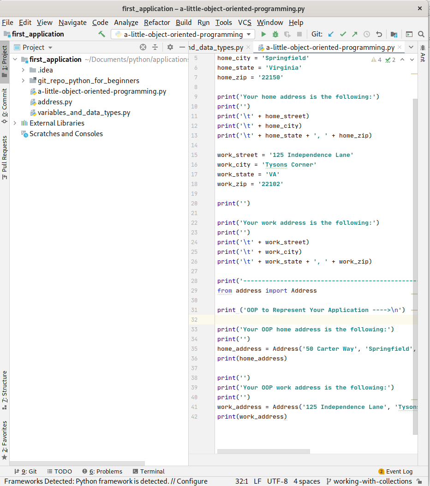

# Working with Python:  Object Oriented Programming (OOP) Part 2

Last updated: 09.08.2020

## Purpose

The purpose of this tutorial is to further your knowledge in Object Oriented Programming (OOP).  You will
be introduced to concepts such as inheritance, polymorphism, encapsulation, and composition.  With knowledge in these
areas of OOP, you will develop a good foundation in OOP. 

## Prerequisites

You have finished the [t3-object-oriented-programming](../t3-object-oriented-programming/readme.md).  
This tutorial provides the necessary foundation you need to perform this tutorial.  If you already have a foundation
in using **OOP**, you may skip this prerequisite.

## Procedures

1. Open up your IntelliJ application. 

    

    On the left part of the screen, you should see the **Project** window and the **first_application**
    folder should be visible. If the **first_application** folder is not open, go to the **File** menu,
    click on the **Open..** menu item, and navigate to the **first_application** folder.

1. Highlight the folder **first_application** in the **Project** window.
1. Right click on **first_application**, select the menu item **New** and the sub menu **Python File** to
create a new Python file as is shown below.

    

1. Name the new file **oop-part2.py**.  Your screen should appear like the screenshot below.
   On the left **Project** window, your python file name is highlighted.  On the right window, your python file
   contents appear.  This is where you will enter your code for the tutorial.

    


### Encapsulation

1. Create the class called **Mammal.py** in IntelliJ.
1. Add the following code to the **Mammal.py** class.

    ```python
    class Mammal:
        def __init__(self, number_of_legs_needed_to_walk = 4):
            self.__number_of_legs_needed_to_walk = number_of_legs_needed_to_walk
    
        def get_number_of_legs_needed_to_walk(self):
            return self.__number_of_legs_needed_to_walk
    
        def walk(self):
            class_name = self.__class__.__name__.lower()
            number_of_legs_needed_to_walk = self.get_number_of_legs_needed_to_walk()
            print ('The ' + class_name + ' walks on ' + str(number_of_legs_needed_to_walk) + ' legs.')
   ```

   Let's break down the code:
   
   1. The line `def __init__(self, number_of_legs_needed_to_walk = 4):` is the constructor for the class.  The method
      has the parameter **number_of_legs_needed_to_walk** and sets the default value to 4.  So as long as your mammal
      can walk on 4 legs, you can create an instance of the mammal class without passing in any arguments.
   
   1. The line `self.__number_of_legs_needed_to_walk = number_of_legs_needed_to_walk` assigns the parameter value of
      **number_of_legs_needed_to_walk** to the instance variable **\_\_number_of_legs_needed_to_walk**.  Instance
      variables beginning with **two underscores** are considered private variables.  Users have to explicitly type the
      **two underscores** before a variable name to access these private variables.  This discourages users from changing
      these variables which could impact the **state** of the instance.  A **state** of an instance is the combination of
      all the values of the instance variables.  For instance, if the **state** was modified by changing the
      **__number_of_legs_needed_to_walk** outside the class to 2, and the instance created was a dog, then the **state**
      would be put into an invalid state for a dog.  However, this is much more likely to happen if you have variables
      not prefixed with **two underscores**.  Users will think it is ok to modify the variable.
      
   1. The line ``def get_number_of_legs_needed_to_walk(self):`` is a method used to get the number of legs for a mammal
      instance.  We use the method to return the value of the private instance variable 
      **\_\_number_of_legs_needed_to_walk**.  This provides access to the value of the variable without allowing the
      variable to be modified.  The capability to make instance (object) variables private, not easily accessible
      outside the instance, and not easily modified outside the instance is called **encapsulation**.
    
   1. The line `def walk(self):` creates the object method **walk**.
   
   1. The line `class_name = self.__class__.__name__.lower()` obtains the class name in
      lower case using built in Python metadata on the class.
   
   1. The line `number_of_legs_needed_to_walk = self.get_number_of_legs_needed_to_walk()` assigns the
      result of calling the object method **self.get_number_of_legs_needed_to_walk()**.
      
   1. The line `print ('The ' + class_name + ' walks on ' + str(number_of_legs_needed_to_walk) + ' legs.')` prints
      out the resulting concatenated string "The mammal walks on 4 legs".
      
1. Add the following content to the **oop-part2.py** file and run the Python file.
   
   ```python
    # Create a mammal and call it's walk method
    from mammal import Mammal      
    mammal = Mammal()
    mammal.walk()
   ```

1. You should get the following output:

    

### Inheritance

1. Create the class called **human.py**.

1. Add the following code to the **human.py** class.

    ```python
    from mammal import Mammal
    
    class Human(Mammal):
        def __init__(self, number_of_legs):
            super().__init__(number_of_legs)
    ```

    Let's break down the code:
    
    1. The line `from mammal import Mammal` imports the **Mammal** class for use.
    
    1. The line `class Human(Mammal):` declares the **Human** class and in parenthesis,
       you see the **Mammal** class.  Inside the parenthesis in the class declaration
       is the parent class.  In this case, the **Mammal** class is the parent of the
       **Human** class.  By naming the parent class **Mammal**, the **Human** class inherits
       all the **Mammal** classes methods.  The process of declaring a parent class and inheriting
       all the parent class methods is **inheritance**. 

    1. The line `def __init__(self):` declares the constructor for the **Human** class.
    
    1. The line `super().__init__(2)` calls the **super** method.  The **super** method returns
       the parent class.  Once we obtain the parent class, the parent constructor **\_\_init\_\_** is called.
       We call the parent class constructor because all the necessary business logic needed to construct
       the **Human** class is in the **Mammal** class. We pass the value of 2 because humans walk on 2 legs.

    1. Notice we don't have a **\_\_str\_\_** method.  When a string representative of a **Human** object is needed,
       the parent **\_\_str\_\_** method is called instead.
       
1. Add the following content to the end of the **oop-part2.py** file and run the Python file.
   
   ```python
    # Create a human and call it's walk method
    from human import Human
    human = Human()
    human.walk()
   ```

1. You should get the following output:

    
    
1. Notice how the human output is "The human walks on 2 legs." while the mammal output is
   "The mammal walks on 4 legs.".  The reason for the different output is explained below:
   
    The **Mammal** class has the **walk** method which is called for both the **Mammal**
    class and the **Human** class.  Let's take another look at the **Mammal** **walk** method:
    
    ```python
    def walk(self):
       class_name = self.__class__.__name__.lower()
       number_of_legs_needed_to_walk = self.get_number_of_legs_needed_to_walk()
       print ('The ' + class_name + ' walks on ' + str(number_of_legs_needed_to_walk) + ' legs.')
    ```

    - The walk method assigns the **class_name** variable to the name of the class.  In the case of the
      **Mammal** class, the value is **mammal**.  In the case of the **Human** class, the value is **human**.
      
    - The next line of code gets the number of legs from the **get_number_of_legs_needed_to_walk** method.
      The method **get_number_of_legs_needed_to_walk** gets the number of legs from the internal variable
      **\_\_number_of_legs_needed_to_walk**.  This internal variable is assigned in the constructor of the
      **Mammal** class.  By default, the constructor assigns the number of legs to 4.  However, the
      **Human** class constructor passes in the value of 2 by calling the **Mammal** constructor.

    - As a result of having a different class and different number of legs passed to the **Mammal** constructor,
      the **Human** class gets the output "The human walks on 2 legs."    

### Polymorphism

1. Add the following code to the end of the **mammal.py** file.

    ```python
     def speak(self):
       print('Mammal speaking....')
    ```

1. Delete all the contents of your **oop-part2.py** file and add the following contents:

    ```python
    # Create a mammal and call it's walk method
    from mammal import Mammal
    
    mammal = Mammal()
    mammal.walk()
    mammal.speak()
    
    print("")
    # Create a human and call it's walk method
    from human import Human
    human = Human()
    human.walk()
    human.speak()
   ``` 

1. Run the **oop-part2.py** class and you should get the following output:

    

1. Notice how the **Human** object calls the **speak** method of the parent by seeing the
   same output "Mammal speaking...".
   
1. Add the following to the end of the **Human** class

    ```python
    def speak(self):
       print('Human speaks...')
    ```
    
1. Run the **oop-part2.py** class and you should get the following output:

    

1. Notice how the **Human** object calls the **speak** method of the **Human** class instead
   of using the **Mammal** class.  This is called method **overriding**.  This is also a form
   of **polymorphism**.  Take a look at the following code snippet:
   
   ```python
    # Call a method that expects a Mammal, but
    # we pass in a human
    def speak_and_walk(obj : Mammal):
        print('')
        print('Walk the mammal:')
        obj.walk()
        print('')
        print('What does the mammal say:')
        obj.speak()
    
    human = Human()
    speak_and_walk(human)
   ```
   
   The code snippet above calls the method with a human value for the required Mammal parameter.  Because a
   human is a Mammal, the call is allowed.  Then, when the method executes, the **speak** method of the Human
   is called instead of the Mammal method.  If we deleted the **speak** method from the Human class, the
   Mammal method would be called again.

:construction:
  
Under construction, please continue to follow along as I build this tutorial.


We have finished our second tutorial on OOP.  To continue to learn more about Python, please proceed back to the main instructions.


[**<--Back to main instructions**](../readme.md)
