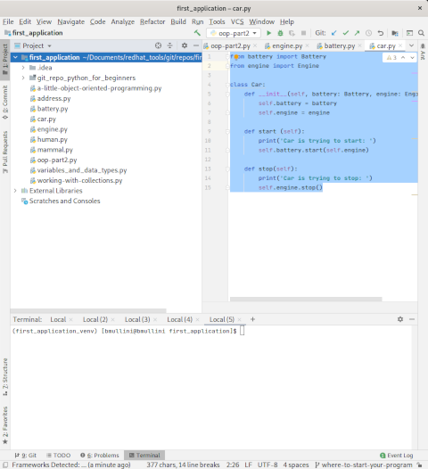
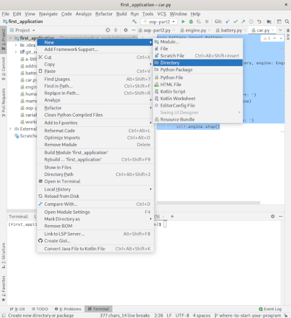
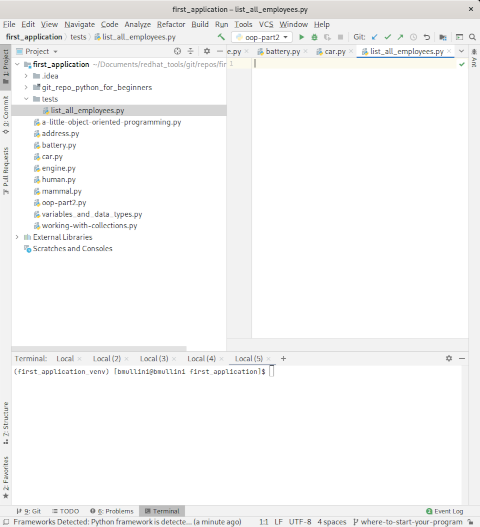
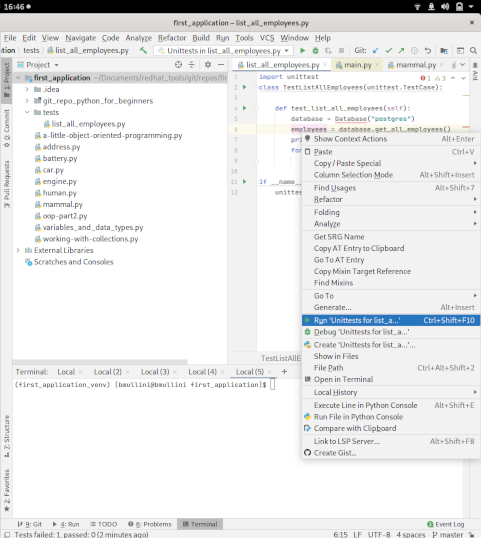
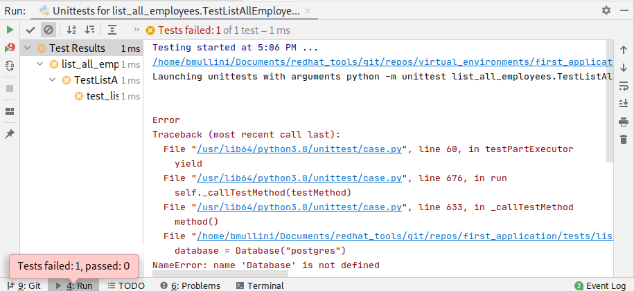
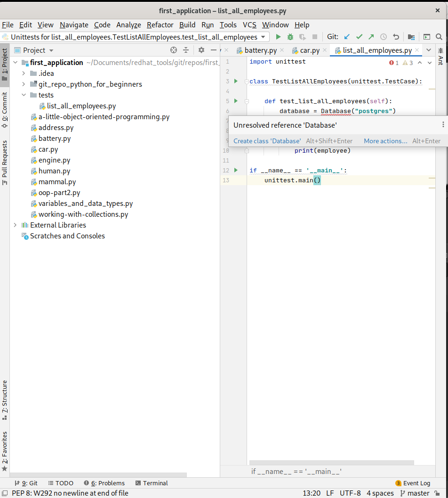
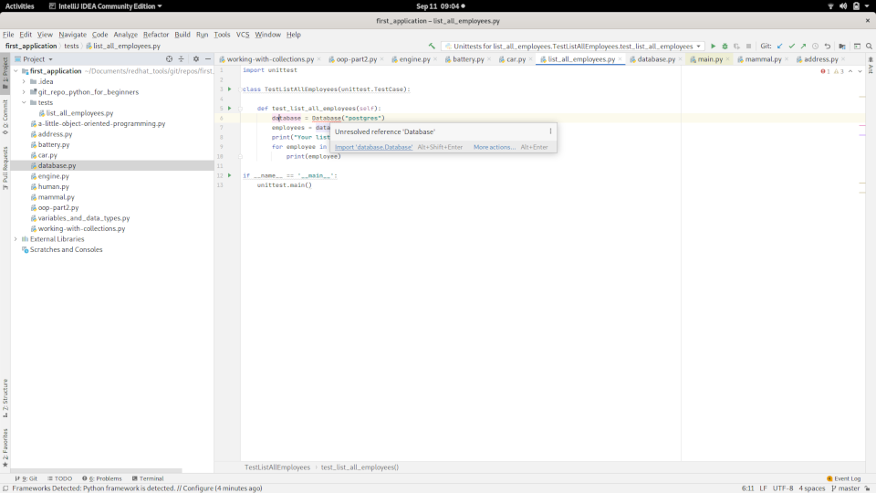
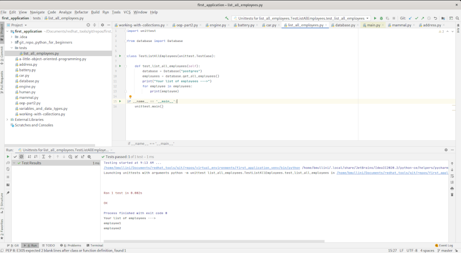

# Working with Python:  Test Driven Development (TDD)

Last updated: 09.10.2020

## Purpose

The purpose of this tutorial is to introduce Test Driven Development (TDD).  You will
be shown how to create features using TDD.  

A feature is a **requirement** or a subset of a **requirement** for an application.

## Prerequisites

You have finished the [t5-oop-part2](../t5-oop-part2/readme.md).  This tutorial provides the necessary foundation you 
need to perform this tutorial.  If you already have a foundation in using **OOP**, you may skip this prerequisite.

## Procedures

1. Open up your IntelliJ application. 

    

    On the left part of the screen, you should see the **Project** window and the **first_application**
    folder should be visible. If the **first_application** folder is not open, go to the **File** menu,
    click on the **Open..** menu item, and navigate to the **first_application** folder.

1. The requirement for this example is **"List all the employees in our application."**.
   The requirement states we have an application.  In this case, we don't have one,
   but we will create our feature as if we did.

1. Let's setup Python testing

    1. Create the **tests** folder using the context menu as is shown below
    
        
    
    1. Under the **tests** folder, let's create a python test file called
       **list_all_employees.py**.  After you create the file, you should
       see the following content.
       
               

    1. Add the following code to the **list_all_employees.py** file.
    
        ```python  
        import unittest      
        class TestListAllEmployees(unittest.TestCase):
        
            def test_list_all_employees(self):
                database = Database("postgres")
                employees = database.get_all_employees()
                print("Your list of employees --->")
                for employee in employees:
                    print(employee)
        
        if __name__ == '__main__':
            unittest.main()
        ```   
     
        Let's explain the code:
        
        1. The line of code `import unittest` imports the **unittest** library.
           This library is used to create the tests and use their
           testing framework.
         
        1. The line of code `class TestListAllEmployees(unittest.TestCase):`
           creates the **TestListAllEmployees** class and this class inherits
           from **unittest.TestCase**.  The **unittest.TestCase** contains
           all the necessary testing infrastructure and methods for performing
           the tests.
           
        1. The line of code `def test_list_all_employees(self):` is indented
           from the class declaration indicating it is a method of the class.
           By passing **self** as a parameter, the method becomes an object method.
           The **self** parameter is the actual object.  You can access
           all the object methods and state (variables) through the
           **self** parameter.
           
           The **test\_** method prefix tells the **unittest** library to treat
           the method as a **test** method.  Any other method without the prefix,
           will not be run as a test.
           
        1. The line of code `database = Database("postgres")` is the first line
           of code for the **test_list_all_employees(self)** method.  The
           line is pseudo code for a database object.  Passing in the parameter
           **"postgres"** indicates the type of database.  We have not created
           the **Database** class. The idea of writing the pseudo code is to 
           capture **what** we want to do, according to the **requirement**, 
           not **how** we are going to do it.  That comes later.
           
        1. The line of code `employees = database.get_all_employees()` calls
           the **get_all_employees** method of the database object created 
           in the previous line.  Because the **Database** class doesn't
           exist, the method **get_all_employees** is pseudo code as well.
           The idea of writing the pseudo code is to capture **what**
           we want to do, according to the **requirement**, not **how** we
           are going to do it.  That comes later.
           
        1. The line of code `print("Your list of employees --->")` just
           prints out the statement "Your list of employees --->".  The
           output is just to indicate the start of listing the employees.
           
        1. The line of code `for employee in employees:` loops through
           each employee in the list returned from the database.
           
        1. The line of code `print(employee)` prints out the current
           employee in the **for** loop.
           
        1. The line of code `if __name__ == '__main__':` is not indented
           under the **def test_list_all_employees(self)** or the
           class declaration.  The line is not part of the class.
           The line of code is only executed when the file is run
           from the command line.  The special variable **\_\_name\_\_**
           is populated with the string **\_\_main\_\_** when
           Python executes the file.  As a result, when the file
           is executed at the command line, the if condition evaluates
           to true.
           
        1. The line of code `unittest.main()` is the method that
           gets called when the Python file runs from the command line.
           The method injects all the necessary code needed to run
           your methods prefixed by **test\_** and runs the tests.
          
1. The code is all pseudo code.  The code captures **what** we
   are suppose to do via the **requirement**.  If we run the test,
   the test will fail.  This represents the **Red** in the 
   **Red**, **Green**, **Refactor** **(RGR)** process of TDD.
      
1. Run a test by placing your cursor in the method code, right clicking to
   get the context menu, and clicking the "Run" menu item.  Below is an
   image of the menu item being selected.
      
    
      
1. Run your test.  The output indicates the **Database** class has not been created.

    

1. The next step is to get us back to **Green** in the **RGR** process of TDD.  The
   **Green** is getting a passing test as quickly as possible that satisfies
   the purpose of the test.  In our case, the purpose of the test also
   satisfies the **requirement** for our example.
   
    1. Your code should show a red underline under the **Database** line.  Hover over the
       red line, you will see possible fixes.  Below is a snapshot of what you will see.
       
        
        
    1. Right click **first_application** and create the **database.py** file.
    
    1. In the **database.py** file, add the following contents:
    
        ```python
        class Database:
           def __init__(self, p_database_type):
               self.database_type = p_database_type
    
           def get_all_employees(self):
               return ["employee1", "employee2"]
        ```
    
    1. Go back to the **list_all_employees.py** test file.
    
    1. Hover over the **Database** line.  You should see the following:
    
        
    
    1. Once you are hovered over **Database**, click on link **import database.Database**.  This will add
       the following code to the top of your file:  `from database import Database`
    
    1. Hover over the test method, right click, and run your test.  Your test should now be in **Green**.  You
       have fulfilled your initial requirement.  You results should look like the image below.
       
       
       
    1. After the **Green** step in the **Red, Green, Refactor** process of Test Driven Design (TDD), you should
       be in the **Refactor** step.  **Refactoring** is the process of recognizing a needed change to the
       code in a test, or the code that is referenced by the test.  Recognizing the need for a change depends
       on the developer.  The developer might see a need for a change based on the data types used or for
       some other reason.  For me, I always like to see maintainable code first.  Also, in my later years,
       I've tried to adhere to **YAGNE** which stands for "You ain't gonna need it.".  So many times
       I've coded for what I thought were going to be future requirements, only to find out the code
       was never used.  Also, by having the extra code, the code distracted other developers from the code that
       was being used.
       
       As I look at our code, the code looks pretty good to me.  I don't see a need to do any refactoring at
       this point.  We have completed our **requirement** and our first rouund of **RGR** and **TDD**.

    
      
        

:construction:

The tutorial is currently under construction.  Please follow along as the tutorial
gets built over the next couple of weeks.


We have finished our tutorial on TDD.  To continue to learn more about Python, 
please proceed back to the main instructions.


[**<--Back to main instructions**](../readme.md)
