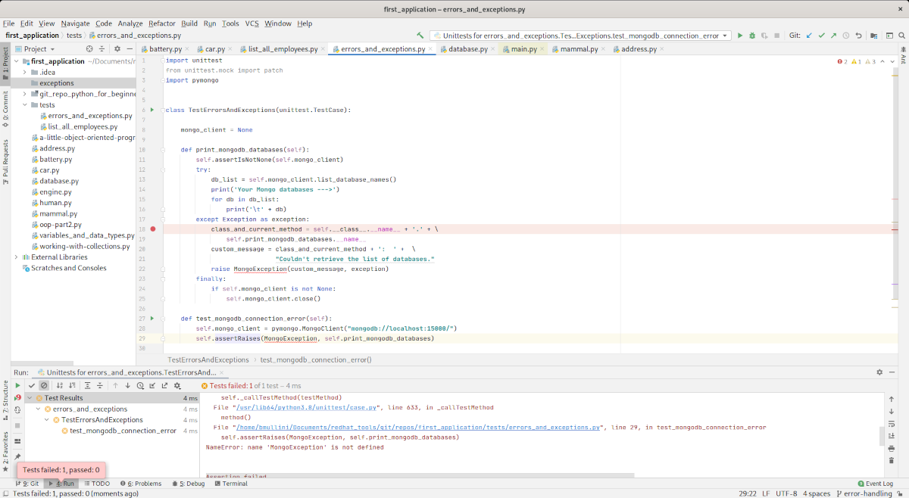

# Working with Python:  Exception Handling

Last updated: 09.16.2020

## Purpose

The purpose of this tutorial is to work with exception handling.  With exception handling,
you will be able to catch errors and exceptions that occur and gracefully recover from them.
Also, with the exception handling, you will see how to clean up resources to prevent
memory leaks, even if a failure occurs.

## Prerequisites

You have finished the [t6-tdd](../t6-tdd/readme.md).  This tutorial provides the necessary foundation
you need to perform this tutorial.  If you already have a foundation
in using **TDD**, you may skip this prerequisite.


## Procedures

1. Open up your IntelliJ application. 

    

    On the left part of the screen, you should see the **Project** window and the **first_application**
    folder should be visible. If the **first_application** folder is not open, go to the **File** menu,
    click on the **Open..** menu item, and navigate to the **first_application** folder.

1. Highlight the folder **first_application** in the **Project** window.

### Catching your First Error

1. Under the **tests** folder, create the class called **errors_and_exceptions.py** in IntelliJ.
1. Open up a terminal as is shown below.

    
    
1. At the terminal, install the Python MongoDB library using the following command `pip install pymongo`

    

1. Add the following code to the **errors_and_exceptions.py** class.

    ```python
    import unittest
    from unittest.mock import patch
    import pymongo
    
    
    
    class TestErrorsAndExceptions(unittest.TestCase):
    
        def test_mongodb_connection(self):  
            mongo_client = pymongo.MongoClient("mongodb://localhost:27017/")
            db_list = mongo_client.list_database_names()
            print('Your Mongo databases --->')
            for db in db_list:
               print('\t' + db)
            mongo_client.close()
    
    
    
    if __name__ == '__main__':
        unittest.main()
   ```

   Let's break down the code:
   
   1. The line `import pymongo` imports the Mongo library needed to interact with a Mongo database server
      in Python.
   
   1. The line `mongo_client = pymongo.MongoClient("mongodb://localhost:27017/")` creates a MongoDB
      client for the Mongo database server located on **localhost** and listening on port **27017**.
      The word **localhost** is always a reference to your computer.
      
   1. The line `db_list = mongo_client.list_database_names()` retrieves a list of databases from
      the **MongoDB** server.
      
   1. The rest of the code just prints out the Mongo database names.

1. Run the test.  You should get a failure similar to the output below.  The test fails because we don't
   have a MongoDB server running on our machine at port 27017 (or if you do, stop MongoDB and re-run the test).

    
    

### Install the MongoDB Server

1. Install **Docker** by following the installation instructions for your operating system
   [here](https://docs.docker.com/get-docker/).  Please read the instructions on **Getting Started**.
   Otherwise, you might have trouble running the **MongoDB** server container below.
   
1. Open up a terminal

1. Run the **MongoDB** docker container by running the following command:

    `docker run -d -p 27017-27019:27017-27019 --name mongodb mongo:4.0.4`
      
      The command says to run the Docker image called **mongo** with the image version of
      **4.0.4**.  The **-d** option says to run the container in the background so 
      you can still use your terminal.  The **-p** option maps your host ports
      **27017-27019** to the container ports **27017-27019**.  The **-name** option
      gives the container the name **mongodb**.
      
1. Open up the **errors_and_exceptions.py** and re-run the test.  The test should be successful and
   you should see results similar to the image below.
   
    
    
    As you can see, you have some pre-configured databases listed when you install the MongoDB server.  
    
Currently, the code is not well written.  The code has no exception handling.  If something goes wrong trying to connect
to the MongoDB server, the application can crash, and since the error happens before the MongoDB
connection is closed, the MongoDB connection could still be taking up memory.
    
###  Add Exception Handling and Clean up the MongoDB Connection

Let's add some exception handling, and if an exception does occur, let's clean up the MongoDB connection.

1. Open up a terminal and start your MongoDB server with the following line:   `docker start mongodb`
1. Open up the **errors_and_exceptions.py** file and replace the class definition
   with the following code.
   
     ```python
    import unittest
    from unittest.mock import patch
    import pymongo
    
    
    class TestErrorsAndExceptions(unittest.TestCase):
    
        mongo_client = None
    
        def print_mongodb_databases(self):
            self.assertIsNotNone(self.mongo_client)
            try:
                db_list = self.mongo_client.list_database_names()
                print('Your Mongo databases --->')
                for db in db_list:
                    print('\t' + db)
            except Exception as exception:
                class_and_current_method = self.__class__.__name__ + '.' + \
                    self.print_mongodb_databases.__name__
                custom_message = class_and_current_method + ':  ' +  \
                                 "Couldn't retrieve the list of databases."
                raise MongoException(custom_message, exception)
            finally:
                if self.mongo_client is not None:
                    self.mongo_client.close()
    
        def test_mongodb_connection_error(self):
            self.mongo_client = pymongo.MongoClient("mongodb://localhost:15000/")
            self.assertRaises(MongoException, self.print_mongodb_databases)
    
    if __name__ == '__main__':
        unittest.main()
    ```

    Let's explain the code:
    
    1. The **try:** keyword followed by the **except** keyword has a block of code within the keywords.
       If the block of code within the keywords throws (raises) an error or an exception, the block of code following
       the `except Exception as exception:` will be processed, so you can gracefully handle the error.
       
    1. The line of code `except Exception as exception:` captures the thrown error in the **exception** variable.
    
    1. The following code will assign a string to the **class_and_current_method** variable.  The string
       value will contain the current class name, **.**, and the method name.  The
       **\** continues the current line of code on to the next line.  The assigned string comes
       from the concatenation of two special variables.  The **self.\_\_class\_\_.\_\_name\_\_** is a special 
       variable in the class which holds the name of the current class as a string.  The variable 
       **self.print_mongodb_databases.\_\_name\_\_** prints the method name.  The beautiful part of the
       previous variable is if you **refactor** (rename) the method name, the variable will be refactored to the
       new method name as well.  Please make sure you use the **refactor** capability to perform renaming, 
       otherwise, you will have all kinds of referenced code where the renaming isn't performed.
       
        ```python
         class_and_current_method = self.__class__.__name__  + '.' +  \
                                   self.print_mongodb_databases.__name__
       ```
      
      1. The next line of code assigns the **class_and_current_name** concatenated with a custom
         message to the **custom_message** variable.
         
      1. The line of code `raise MongoException(custom_message, exception)` throws the exception to the
         method that called this method.  If the calling method does not handle it, the exception is thrown
         up the call stack until no other parent methods are available to handle the error.  If this happens,
         the program/application will crash and will print the output of the error.
         
      1. The line of code `finally:` is a keyword for the Python **try** block.  If the **try** block 
         code executes successfully or fails, the indented code under the **finally** keyword will be
         executed.  In this case, the **Mongo** client resource will be closed regardless of success
         or an error.  As a result, the resource will not stay around longer than needed. 
         
      1. The line of code `self.assertRaises(MongoException, self.print_mongodb_databases)` is a **unittest**
         method that calls the method **print_mongodb_databases** and ensures the **MongoException**
         is raised (thrown).  If no exception gets raised, the test fails.  In our case, we set the port
         of the **mongo_client** variable to **15000**, the MongoDB server does not run on this port, so
         an error should be produced.
         
1. The code above purposely was introduced with an error.  The class **MongoException** does not exist.
   Remember, we are coding using **TDD**.  In **TDD**, we must follow the **Red, Green, Refactor (RGR)**
   process.  As a result, we have to prove the test fails.
  
1. Run the test **test_mongodb_connection_error**.  You should see the following failure.

    
    
    Notice the output shows the **MongoException** class does not exist.
    
1. Within the Project Explorer, click on the **first_applications** and create the **exceptions** folder.

1. Within the Project Explorer, click on the **exceptions** folder and create the Python file called
   **mongo_exception.py**.
   
1. Open up the **mongo_exception.py** file and add the following code.

    ```python
    class MongoException(Exception):

       def __init__(self, custom_message, inner_exception):
           self._custom_message = custom_message
           self._inner_exception = inner_exception

       def __str__(self):
           result = self._custom_message + "\n" + \
           str(self._inner_exception)
           return result      
    ```

    Let's explain the code:
    
    1. The class signature lists the **Exception** class as the parent class indicating that the
       **MongoException** class is an exception.
       
    1. The constructor assigns the custom message and exception caused by the system to the
       private variables **\_custom_message** and **\_inner_exception** respectively.
       
    1. The **__str__** method will get called to display the error. 
       
1. Open the **errors_and_exceptions.py** class and click on the link 
   **import exceptions.mongo_exception.MongoException(Exception)** as is shown below.

    

1. Run the test **test_mongodb_connection_error**.  The test succeeds.  We are in the
   **Green** in the **RGR** of **TDD**.
   
    

1. The last step of **RGR** is to look at the code to see if any code needs refactoring.
   We won't do any refactoring so we have completed the **RGR** process of **TDD**.

1. Add the following test method to the **errors_and_exceptions.py** file.

    ```python
        def test_mongodb_connection(self):
            self.assertEqual(1,2)
   ```
   
1. We are forcing a failure or our **Red** in **RGR** of **TDD**.

1. Change the test method to be the following code.

    ```python
   def test_mongodb_connection(self):
       try:
           self.mongo_client = pymongo.MongoClient("mongodb://localhost:15000/")
           self.print_mongodb_databases()
       except Exception as exception:
           print(exception)
           self.fail("You had an error.")
    ```

    Most of the lines of code can be explained by the explanation of the **try** and **except** block 
    above.  We didn't include the **finally** block because the **self.print_mongodb_database()**
    takes care of closing the mongodb client.
    
    Let's explain the new code:
   
    1. The line of code **self.fail("You had an error")** calls the **fail** method of the
       **unittest** framework.  The method will cause the test to fail.  We fail the test because
       we don't expect a failure for this test.

1. Run the test method.  The test still fails.  The mongo client still uses **15000** instead of
   **27017**.
   
    
    
1. Change the port to **27017* and run the test.

1. The test runs successfully, and you are now back in the **Green** in the **RGR** of **TDD**.

   
   

1. The last step of **RGR** is to look at the code to see if any code needs refactoring.
   We won't do any refactoring so we have completed the **RGR** process of **TDD**.

1. We are finished with our testing.  Open up a terminal and remove the MongoDb server
   using the following code:
   
    ```commandline
     docker stop mongodb
     docker rm mongodb
    ```

During the testing of the MongoDB connection, we introduced two tests, and the method
called **print_mongodb_databases**.  The **print_mongodb_database** method was used by both tests
and contained code with the **try**, **except**, and **finally** blocks.  When the code in the
**try** block failed, the code in the **except** block determined how to handle the exception
and recover from the exception if possible.  Despite success or failure of the code in the **try**
block, the **finally** block code executed.  The **finally** block code always executed after any
code in the **try** and **finally** blocks.
   
We have finished our tutorial on exception handling.  To continue to learn more about Python, 
please proceed back to the main instructions.


[**<--Back to main instructions**](../readme.md)
